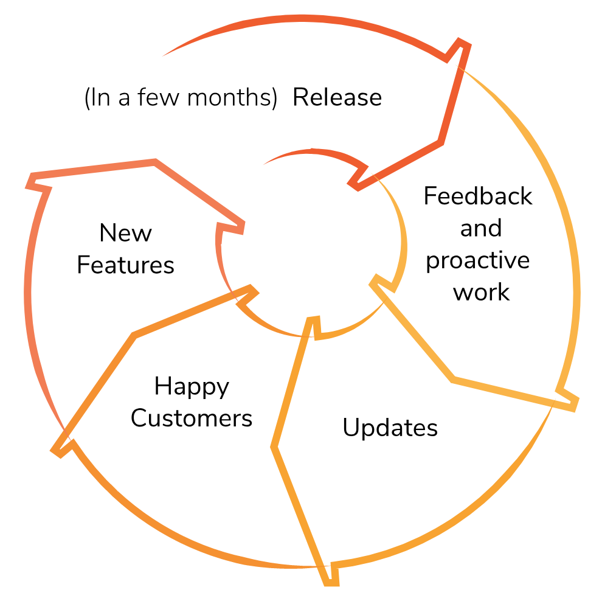

# WSO2 Updates

Welcome to the WSO2 Updates documentation! 

<table>
<tbody>
<tr class="odd">
<td style="text-align: left;">

</td>
<td>

 

<h3 id="WSO2Updates-GetstartedwithWSO2Updates">Get started with WSO2 Updates</h3>

<table>
<colgroup>
<col style="width: 50%" />
<col style="width: 50%" />
</colgroup>
<tbody>
<tr class="odd">
<td>

</td>
<td><strong><a href="Introduction_103318227.html">Introduction</a></strong> 
What are WSO2 Updates.</td>
</tr>
<tr class="even">
<td></td>
<td><strong><strong><a href="Using-WSO2-In-Place-Updates_103318230.html">WSO2 In-Place Updates</a></strong> 
</strong>Get updates using the WSO2 in-place updates tool.</td>
</tr>
<tr class="odd">
<td></td>
<td><strong><strong><a href="Using-WSO2-Update-Manager_103318231.html">WSO2 Update Manager</a></strong> 
</strong>Get updates using WSO2 Update Manager (WUM).</td>
</tr>
<tr class="even">
<td></td>
<td><strong><a href="FAQ_103318229.html">FAQs</a></strong> 
Have a question? Check here.</td>
</tr>
</tbody>
</table>

 

 

</td>
</tr>
</tbody>
</table>

## Attachments:

{width="8" height="8"}
[wum-pdf-header.png](attachments/103318206/103318207.png) (image/png)  
{width="8" height="8"}
[WSO2-WUM.png](attachments/103318206/103318208.png) (image/png)  
{width="8" height="8"}
[docs-header-carbon.png](attachments/103318206/103318209.png)
(image/png)  
{width="8" height="8"}
[logo-Carbon.png](attachments/103318206/103318210.png) (image/png)  
{width="8" height="8"}
[product-carbon-banner.png](attachments/103318206/103318211.png)
(image/png)  
{width="8" height="8"}
[platform.jpeg](attachments/103318206/103318212.jpeg) (image/jpeg)  
{width="8" height="8"}
[Monitoring.png](attachments/103318206/103318213.png) (image/png)  
{width="8" height="8"}
[wso2-carbon-architecture-small.png](attachments/103318206/103318214.png)
(image/png)  
{width="8" height="8"}
[wso2-carbon-products-small.png](attachments/103318206/103318215.png)
(image/png)  
{width="8" height="8"}
[background\_page2.png](attachments/103318206/103318216.png)
(image/png)  
{width="8" height="8"}
[bottom\_page\_background.png](attachments/103318206/103318217.png)
(image/png)  
{width="8" height="8"}
[image2018-4-4\_14-56-34.png](attachments/103318206/103318218.png)
(image/png)  
{width="8" height="8"}
[image2018-4-4\_14-45-48.png](attachments/103318206/103318219.png)
(image/png)  
{width="8" height="8"}
[Open-banking-cover.png](attachments/103318206/103318220.png)
(image/png)  
{width="8" height="8"}
[Concept.png](attachments/103318206/103318221.png) (image/png)  
{width="8" height="8"}
[GettingStarted.png](attachments/103318206/103318222.png) (image/png)  
{width="8" height="8"}
[wum-h-banner.png](attachments/103318206/103318223.png) (image/png)  
{width="8" height="8"}
[InstallationGuide.png](attachments/103318206/103318224.png)
(image/png)  
{width="8" height="8"}
[About.png](attachments/103318206/103318225.png) (image/png)  
{width="8" height="8"}
[ADMIN44x-300617-0239-86.pdf](attachments/103318206/103318226.pdf)
(application/pdf)  
